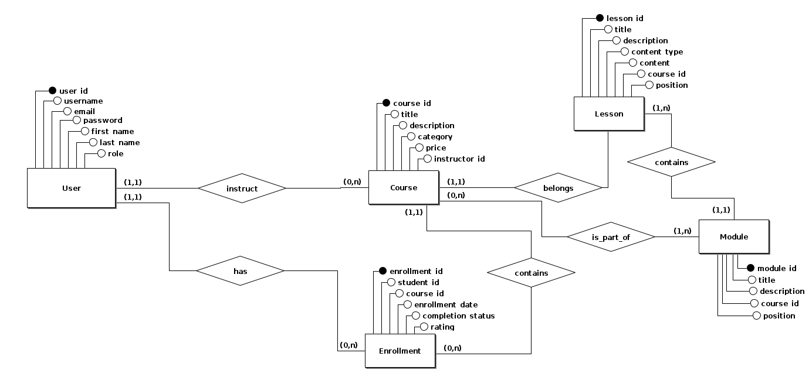

# Learnify

Learnify is an online course platform that enables instructors to create and manage online courses, and students to enroll and learn from them. This project aims to develop a robust and scalable backend for the platform. Learnify is a project for the course of **Databases** at the **Federal University of Ouro Preto (UFOP)** in Brazil.

- [Learnify](#learnify)
  - [1. Project Overview](#1-project-overview)
  - [2. Features](#2-features)
  - [3. ER Diagram](#3-er-diagram)
  - [4. Development Setup](#4-development-setup)
  - [5. API Documentation](#5-api-documentation)
  - [6. Contributing Guidelines](#6-contributing-guidelines)
  - [7. License](#7-license)
  - [8. Contact](#8-contact)

## 1. Project Overview

This project aims to develop a robust and scalable backend for an online course platform. The platform will enable instructors to create and manage online courses, and students to enroll and learn from them.

**Key functionalities:**

- User management: User registration, login, role-based access control.
- Course management: Create, edit, publish, and manage courses.
- Content management: Create and manage different types of learning materials (video, text, quizzes).
- Enrollment management: Students enroll in courses, track their progress, and receive certificates.
- Payment processing: Instructors can set prices for their courses, and the platform can handle secure payments.

**Technology Stack:**

- Backend framework: Flask
- Testing framework: Pytest
- Relational database: PostgreSQL
- Authentication and authorization libraries
- Payment processing API

## 2. Features

**Planned features:**

- **User management:**
  - User registration and login with email and password
  - User profile management (name, bio, avatar)
  - Role-based access control (student, instructor, admin)
- **Course management:**
  - Create and edit courses
  - Set prices and enrollment options
  - Organize content into modules and lessons
  - Publish and unpublish courses
- **Content management:**
  - Create different types of content (video, text, quizzes)
  - Upload and manage learning materials
  - Edit and update content
- **Enrollment management:**
  - Students enroll in courses
  - Track progress through modules and lessons
  - View course materials and complete quizzes
  - Receive certificates upon completion
- **Interactive learning:**
  - Create and manage quizzes with various question types
  - Grade quizzes automatically
  - Provide feedback and solutions to students
  - Facilitate discussion forums for students and instructors
- **Payment processing:**
  - Instructors set prices for their courses
  - Secure payment gateway integration
  - Manage earnings and payouts

**Additional features to be further implemented:**

- Gamification elements to motivate students
- Personalized learning recommendations
- Live streaming and webinars
- Mobile application for accessing courses on the go
- Learning analytics and reporting

## 3. ER Diagram

The following ER diagram shows the database schema for the application:

## 4. Development Setup

To set up the development environment, please follow these steps:

`To be added.`

## 5. API Documentation

The backend API provides various endpoints for managing users, courses, content, enrollments, and payments. The API documentation will be available in a dedicated section of the repository, including:

- API reference with detailed information on each endpoint
- Authentication and authorization requirements
- Request and response formats with examples
- Error codes and handling

## 6. Contributing Guidelines

We welcome contributions to this project. Please follow these guidelines when contributing:

- Fork the repository and create a branch for your changes.
- Write clean and well-documented code.
- Include unit tests for your code.
- Submit a pull request with a clear description of your changes.

## 7. License

This project is licensed under the MIT License: LICENSE.

## 8. Contact

For any questions or issues, please feel free to create an issue on the project repository.

This README serves as an initial overview of the project. More detailed information on specific aspects, such as API documentation, development setup, and contributing guidelines, will be provided in separate documents within the repository.
